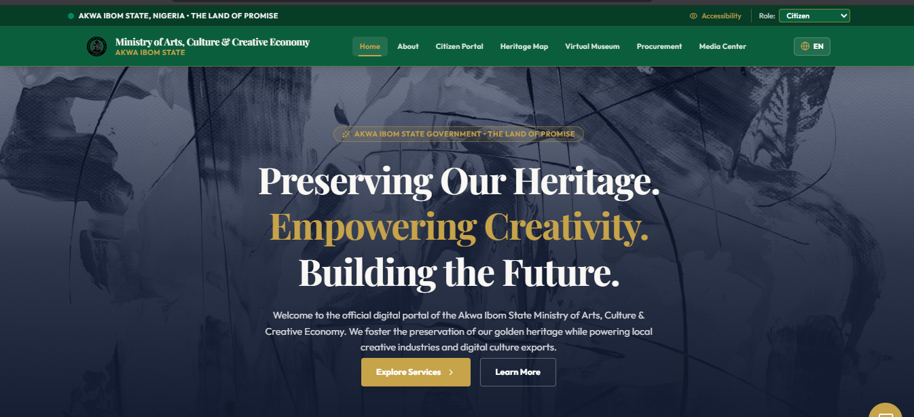

# Akwa Ibom State Ministry of Arts, Culture & Creative Economy

> **Preserving Our Heritage. Empowering Creativity. Building the Future.**

A modern digital government platform developed with **TypeScript**, **Next.js**, and modern web technologies to promote cultural heritage, empower creative industries, provide digital government services, and preserve the rich traditions of **Akwa Ibom State, Nigeria — The Land of Promise**.

<p align="center">
    
</p>

<p align="center">
    <strong>Modern • Accessible • Secure • Citizen-Centered</strong>
</p>

<p align="center">
    <a href="https://ministry-of-arts-culture-website.vercel.app">🌐 Live Demo</a>
    •
    <a href="https://github.com/God-Did-Vel/Ministry-of-Arts-Culture-Creative-Economy-Akwa-Ibom-State">📂 GitHub Repository</a>
</p>

---

# 📖 About

The **Akwa Ibom State Ministry of Arts, Culture & Creative Economy** website is a comprehensive e-government platform that connects citizens, artists, researchers, tourists, investors, and cultural institutions through one centralized digital ecosystem.

The platform celebrates the state's cultural identity while providing digital services such as artist registration, grant applications, festival permits, heritage preservation, virtual museums, interactive cultural maps, and public information.

Built using **TypeScript** and **Next.js**, the application focuses on performance, accessibility, security, scalability, and an exceptional user experience.

---

# ✨ Features

## 🏛 Ministry Information

* Ministry Overview
* Vision & Mission
* Commissioner's Welcome
* Ministry Leadership
* Departments
* Government Publications

---

## 👥 Citizen Portal

* Artist Registration
* Creative Industry Directory
* Digital Artist ID
* Application Tracking
* Digital Certificates
* Profile Management

---

## 💰 Creative Grants

* Apply for Government Grants
* Upload Proposals
* Budget Submission
* Application Tracking
* Grant Notifications

---

## 🎉 Festival & Cultural Events

* Event Calendar
* Festival Registration
* Digital Tickets
* QR Verification
* Event Details
* Capacity Tracking

---

## 🗺 Heritage Explorer

* Interactive Cultural Map
* Local Government Heritage Directory
* Historical Landmarks
* Museums
* Traditional Communities
* Cultural Zones

---

## 🏺 Virtual Museum

* 3D Artifact Gallery
* Virtual Museum Tours
* Ancient Carvings
* Historical Archives
* Audio Guides
* Digital Collections

---

## 📰 News & Media Center

* Ministry News
* Press Releases
* Government Announcements
* Projects
* Speeches
* Publications

---

## 🍲 Cultural Heritage

* Traditional Cuisine
* Indigenous Languages
* Traditional Clothing
* Cultural Festivals
* Local Crafts
* Performing Arts

---

## 📄 E-Government Services

* Cultural Permits
* Festival Hosting Approval
* Freedom of Information Requests
* Public Complaints
* Procurement Portal
* Official Downloads

---

# 🎨 Design Highlights

* Premium Government UI
* Modern Dashboard
* Elegant Typography
* Fully Responsive Layout
* Smooth Animations
* Interactive Components
* Accessibility Support
* Dark Mode Ready
* Mobile-First Design
* Optimized Performance

---

# 🚀 Technology Stack

## Frontend

* Next.js
* React
* TypeScript
* Tailwind CSS
* Framer Motion

## Backend

* Node.js
* Express.js

## Database

* PostgreSQL

## Authentication

* JWT Authentication
* Role-Based Access Control

## Storage

* Cloudinary

## Deployment

* Docker
* Nginx
* GitHub Actions

---

# 📂 Project Structure

```text
ministry-art-culture/
├── app/
├── components/
├── public/
│   └── images/
├── hooks/
├── lib/
├── services/
├── styles/
├── types/
├── utils/
├── README.md
└── package.json
```

# 🌍 Core Modules

* Ministry Information
* Citizen Portal
* Artist Registry
* Creative Grants
* Heritage Explorer
* Virtual Museum
* Festival Management
* Media Center
* News & Publications
* Procurement Portal
* Contact Center
* Accessibility Features

---

# ⚙️ Installation

```bash
git clone https://github.com/God-Did-Vel/Ministry-of-Arts-Culture-Creative-Economy-Akwa-Ibom-State

cd ministry-art-culture

npm install

npm run dev
```

---

# 📦 Production

```bash
npm run build

npm start
```

---

# 🌟 Future Improvements

* AI Cultural Assistant
* Voice Translation
* Multi-language Support
* Museum VR Experience
* Online Ticket Payments
* Digital Archive API
* Mobile Application
* GIS Mapping Integration
* Tourism Recommendation Engine
* Creative Marketplace
* Open Government Data API

---

# 🔒 Security

* JWT Authentication
* Role-Based Access Control
* Secure API Routes
* Input Validation
* Rate Limiting
* Activity Logs
* Two-Factor Authentication
* Secure Document Uploads

---

# 🌍 Accessibility

* WCAG Compliant
* Keyboard Navigation
* Screen Reader Support
* Adjustable Font Sizes
* High Contrast Mode
* Speech Support
* Responsive Across All Devices

---

# 🤝 Contributing

Contributions are welcome. Feel free to fork the repository, improve existing features, fix issues, or introduce new functionality through pull requests.

---

# 📄 License

Licensed under the **MIT License**.

---

#  Author

**Vel Mfoniso**

Full Stack Software Engineer

📧 **Email:** [Mfonisocletus124@gmail.com](mailto:Mfonisocletus124@gmail.com)

💻 **GitHub:** https://github.com/God-Did-Vel
---

# ⭐ Support

If you found this project useful or inspiring, please consider giving it a **⭐ Star** on GitHub.

Your support encourages the continued development of modern digital government solutions.

---

<p align="center">
    <strong>🎭 Akwa Ibom State Ministry of Arts, Culture & Creative Economy</strong><br><br>
    <em>Preserving Our Heritage. Empowering Creativity. Building the Future.</em>
</p>
